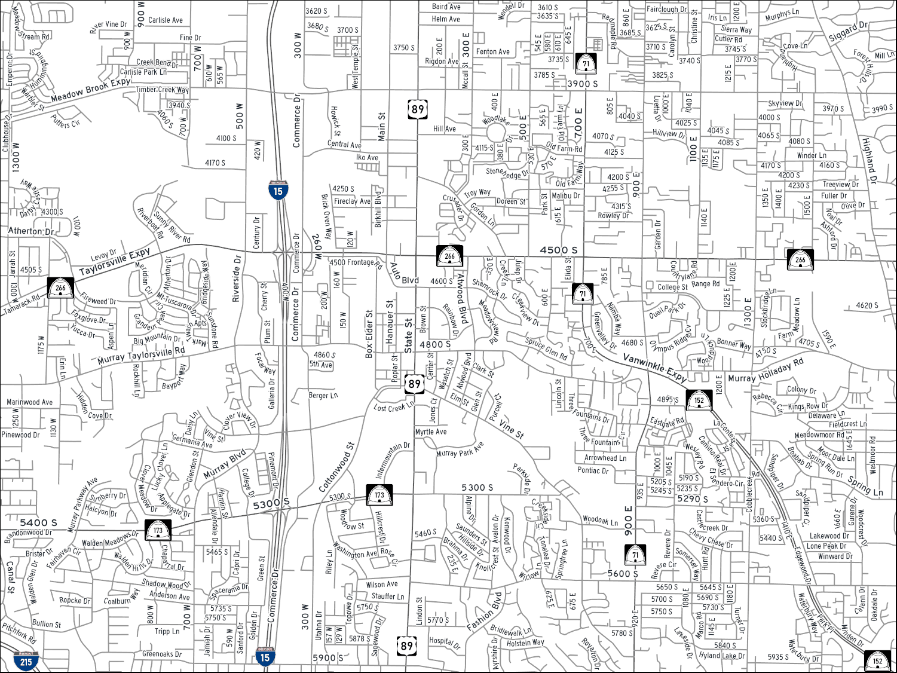
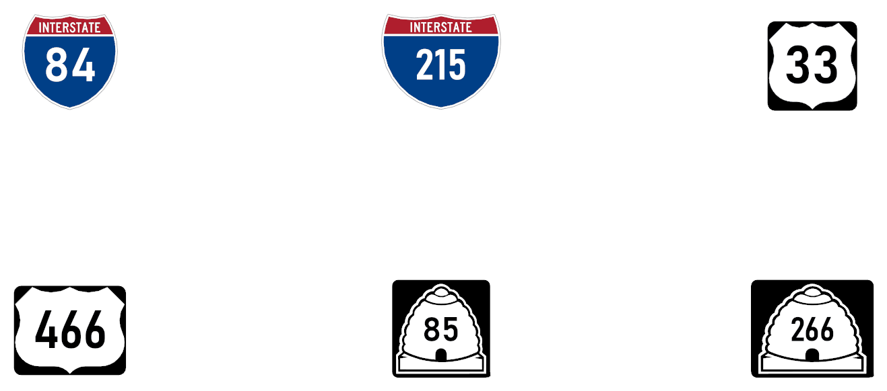
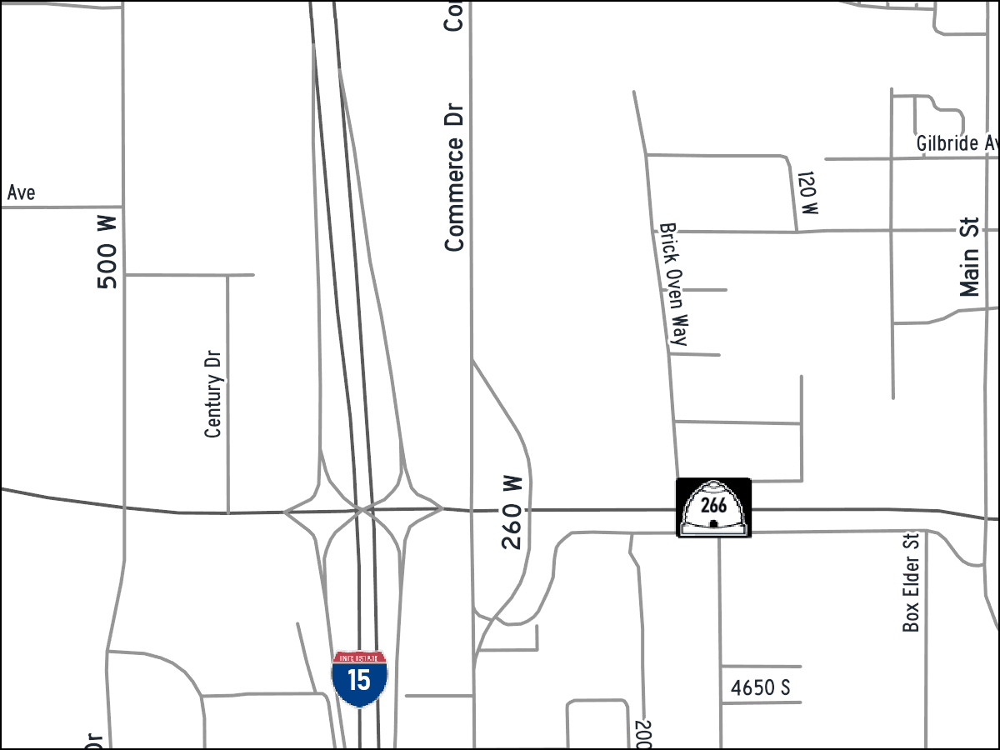
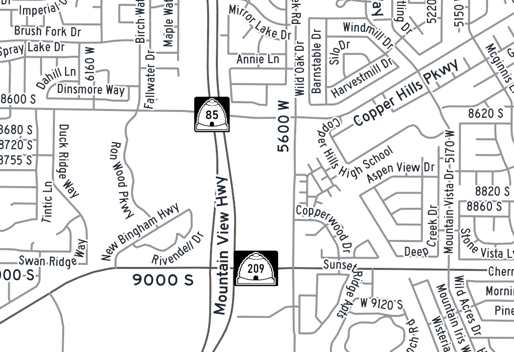

# Utah road labels

`road_labels.py` labels UGRC's [Utah Roads](https://gis.utah.gov/products/sgid/transportation/road-centerlines/)
(SGID `Transportation.Roads`) in ArcGIS Pro for a 1:30,000 map. One run replaces
the layer's label classes with:

- **Highway shields.** Interstate, US route and Utah state route shields (the
  beehive), drawn as vector graphics from the MUTCD and UDOT sign designs. The
  route number is live text, fitted into each shield.
- **Street names.** Arcade label classes keyed on `CARTOCODE`, set in the Roadgeek
  2014 FHWA Series fonts ("Highway Gothic"). Maplex spaces them for 1:30,000.

It can also package the map as vector tiles for ArcGIS Online.



*Millcreek and Murray at 1:30,000, from UGRC data on 2026-09-25. The grey road
lines are test symbology only; the script sets labels, not line symbols.*



*The widest numbers each shield must hold, drawn by Pro at 1:30,000 and exported
at 600 dpi.*

**Contents:** [Quick start](#quick-start) · [Requirements](#requirements) ·
[Setup](#setup) · [Usage](#usage) · [Vector tiles for ArcGIS Online](#vector-tiles-for-arcgis-online) ·
[How it works](#how-it-works) · [Customising](#customising) · [Files](#files) ·
[Testing](#testing) · [Troubleshooting](#troubleshooting) ·
[Licences and sources](#licences-and-sources) · [Limits](#limits) · [History](#history)

## Quick start

```powershell
$proPython = 'C:\Program Files\ArcGIS\Pro\bin\Python\envs\arcgispro-py3\python.exe'

# once per Windows user: install Roadgeek (unzipped RG2014-3.10.zip), then restart Pro
& $proPython road_labels.py --install-fonts C:\temp\RG2014

# per map: close the project in Pro, then
& $proPython road_labels.py C:\maps\roads.aprx --layer Roads --dry-run
& $proPython road_labels.py C:\maps\roads.aprx --layer Roads
```

Open the project in Pro. The layer's labels are on, and the map's reference
scale is 1:30,000.

## Requirements

- **ArcGIS Pro.** Built and tested with Pro 3.7.2 and its Python 3.13. The script
  uses arcpy and Pro's bundled fontTools, Pillow and NumPy. Pro must be licensed
  at any level.
- **A Utah Roads layer** in a map. Either the UGRC service works
  (`https://services1.arcgis.com/99lidPhWCzftIe9K/ArcGIS/rest/services/UtahRoads/FeatureServer/0`)
  or a downloaded copy. It needs the fields `CARTOCODE`, `DOT_HWYNAM`,
  `DOT_RTNAME`, `A1_NAME`, `A2_NAME` and `FULLNAME`.
- **Windows 10 or 11.** The shield numbers use Bahnschrift, which ships with Windows.
- **Roadgeek 2014** for street names. It's MIT-licensed and installed once per
  user (see [Setup](#setup)).

## Setup

1. Download `RG2014-3.10.zip` from the
   [roadgeek-fonts releases](https://github.com/sammdot/roadgeek-fonts/releases)
   (Roadgeek 2014 v3.1) and unzip it.
2. Install it for your Windows user. This needs no admin rights:

   ```powershell
   & $proPython road_labels.py --install-fonts C:\temp\RG2014
   ```

   This copies the `.ttf` files to your user fonts folder, registers them, and
   loads them into the current Windows session.
3. Restart ArcGIS Pro, which reads its font list at start-up.

The fonts aren't in this repository.

**Fonts must be loaded, not only installed.** A font Windows hasn't loaded
doesn't raise an error in Pro. Pro silently draws Arial in its place, in layouts
and in vector tiles alike. That once made the shield numbers overflow their
frames. So before it runs, the script checks what Windows has actually loaded. It
loads any required font that is installed but not loaded, and stops with a clear
error if one is missing.

## Usage

```powershell
& $proPython road_labels.py C:\maps\roads.aprx --layer Roads --dry-run   # list routes and shields, change nothing
& $proPython road_labels.py C:\maps\roads.aprx --layer Roads             # write the labels, save in place
& $proPython road_labels.py C:\maps\roads.aprx --layer Roads --save-as C:\maps\roads_labelled.aprx
& $proPython road_labels.py C:\maps\roads.aprx --layer Roads --vtpk C:\maps\utah_roads.vtpk
```

Close the project in Pro before running from the command line, because the
script saves the `.aprx`. Use `--save-as` to leave the original untouched.

| Option | Default | Meaning |
|---|---|---|
| `project` | | The `.aprx` to update |
| `--map` | first map | Map that holds the roads layer |
| `--layer` | `Roads` | Name of the Utah Roads layer; exactly one feature layer must match |
| `--reference-scale` | 30000 | Map reference scale that label and shield sizes are set for |
| `--upper-case` | off | Keep street names in capitals (`VANWINKLE EXPY`) |
| `--save-as` | save in place | Save to a new `.aprx` |
| `--vtpk` | none | Also write a vector tile package ([below](#vector-tiles-for-arcgis-online)) |
| `--dry-run` | off | Report the routes found and how each gets a shield; change nothing |
| `--install-fonts FOLDER …` | | Install the Roadgeek (and DDV) fonts in these folders, then exit |
| `--shields` | `mutcd` | `ddv` uses the older Data Deja View font shields ([below](#the-ddv-option)) |
| `--series`, `--us-wide` | | DDV options only |

A dry run lists every route the layer holds:

```
  I-215    MUTCD
  SR 48    MUTCD
  SR 85    MUTCD
  ...
  SR 209   MUTCD
10 routes: 10 MUTCD
```

**From Pro's Python window**, with the project open:

```python
import sys; sys.path.append(r"V:\Developer\agol-python-scripts\utah-road-labels")
import road_labels
m = arcpy.mp.ArcGISProject("CURRENT").activeMap
road_labels.label_layer(m.listLayers("Roads")[0], map_=m)
```

**What a run changes:**
- The layer's label classes are replaced, and labelling is turned on.
- The map's reference scale is set to 1:30,000.
- Nothing else in the project changes: not the line symbology, and not other
  layers.

The run makes shield classes only for the networks and digit counts the layer
contains. It is safe to re-run.

## Vector tiles for ArcGIS Online

`--vtpk` writes a vector tile package for zoom levels 10–16 (about 1:578,000 to
1:9,000). Upload it to ArcGIS Online (*Content → New item*), then publish it as a
tile layer. The script doesn't publish anything.



*The package drawn back in Pro.*

What happens in the conversion:
- **Shields** become sprite images: one blank shield per network and digit count.
  The number is drawn over the sprite as text, so the sign stays sharp.
- **Fonts** are embedded as glyphs: Roadgeek C, D and E, and Bahnschrift at the
  shields' weight and width.
- **Repeat distances** become the tile style's `symbol-spacing`. The map client
  places labels itself, so the other Maplex rules don't carry over.
- **Name offset.** Pro drops the offset that keeps names beside their street. The
  script patches the package's style afterwards, adding `text-offset` to the
  name layers.
- **Map preparation.** Packaging needs a Web Mercator map with a description.
  The script switches the map to Web Mercator while it packages, then switches
  back. It also fills in a map description if there isn't one.

**Check the licence before publishing tiles.** Bahnschrift is a Microsoft-supplied
Windows font. It's fine in Pro layouts and PDFs, but tiles embed its glyphs,
which amounts to redistributing the font. The Millcreek layout standard allows
only open-licensed fonts inside web maps. `--vtpk` prints a reminder. Two ways
through:
- Confirm the licence covers this use.
- Or change the numeral font in `build_shields.py` to an open-licensed one before
  building tiles (see [Customising](#customising)).

Map Viewer labels on a plain feature layer can't draw shields at all.

## How it works

### Which route a road is on

Every shield and name decision starts from one route key per road segment. The
key comes from, in order:

| Source | Example | Key |
|---|---|---|
| `DOT_HWYNAM` | `SR 152` | `SR 152` |
| `DOT_RTNAME`, when `DOT_HWYNAM` is blank; `CARTOCODE` 1 → I, 2–3 → US, otherwise SR | `0177P` | `SR 177` |
| `A1_NAME`, then `A2_NAME` | `HWY 48`, `SR-17`, `I-80 EB` | `SR 48`, `SR 17`, `I-80` |

UDOT left `DOT_HWYNAM` blank on 41 segments statewide (September 2026). The
`DOT_RTNAME` fallback accepts only four-digit route numbers under 1000, so ramp
IDs (`0080PR11105`) and local numbers (`3201P`) fall through to the aliases.

The logic exists twice: in Arcade, because Pro evaluates it per feature while
labelling, and in Python, for the dry run and the tests. The tests run both
through Calculate Field on the same features. They agreed on all 18,005 segments
of the Millcreek test extent.

### Label classes

| Class | Features | Font and size | Repeats every (page) | Hidden beyond |
|---|---|---|---|---|
| Interstate shields, 1–2 / 3 digits | Interstate routes | 17 pt shield, Bahnschrift SemiBold | 5 in | 1:500,000 |
| US route shields, 1–2 / 3 digits | US routes | 16 pt shield | 4.5 in | 1:250,000 |
| State route shields, 1–2 / 3 digits | State routes | 17.5 pt beehive | 4 in | 1:150,000 |
| Highway names | `CARTOCODE` 2–6 | Roadgeek Series E, 9.5 pt | 5 in | 1:60,000 |
| Major streets | 8, 10 | Series D, 9.25 pt | 5 in | 1:45,000 |
| Local streets | 11 | Series C, 8 pt | 6 in | 1:32,000 |
| Unpaved and 4WD roads | 9, 16 | Series C, 8 pt, brown | 6 in | 1:32,000 |

- Interstates (`CARTOCODE` 1) are named by their shields alone.
- Ramps (7), and codes 12–15, 17, 18 and 99 (non-road features, driveways,
  proposed roads, service and access roads), get no labels.
- Priority runs top to bottom: shields first, then highway names, down to
  unpaved roads.

### Shields

- **Artwork.** There are six blank signs: 24 × 24 for one or two digits, and
  30 × 24 for three, as on the road. They come from public-domain Wikimedia
  Commons templates:
  - `I-00 template.svg` and `I-000 template.svg`
  - `US 00 template.svg` and `US 000 template.svg`
  - `Utah 00 template.svg` and `Utah 000 template.svg`

  `build_shields.py` converted them to CIM vector-marker geometry in
  `mutcd_shields.json`. It keeps the curves as Béziers, so the shields stay sharp
  at any size and resolution. Each class draws its shield as the label's
  point-symbol callout, with the number as the label text. New routes need no
  new classes.
- **Numerals.** Bahnschrift, the DIN 1451-based face that ships with Windows,
  SemiBold. Three-digit numbers use its semi-condensed width (87.5%).
  - It won out over Roadgeek Series D/C (the signs' own numerals), Franklin
    Gothic, Source Sans 3, Myriad, Arial Narrow and a faux-bold Roadgeek on a
    board rendered by Pro at 1:30,000. It reads most solidly at a quarter inch.
    The board is `docs/numeral-study.png`.
  - Bahnschrift is a variable font. Its weight and width reach Pro as axes
    (`CIMTextSymbol.fontVariationSettings`); a style name alone gets the default
    Regular.
- **Numeral fit.** A sign's numerals are proportioned for a 24-inch sign read
  from a car, and crowd the frame on a quarter-inch map shield. `build_shields.py`
  therefore fits each shield's numerals:
  - It rasterises the shield, finds the field behind the number, and starts at
    the sign's numeral height.
  - It shrinks the numbers about the sign design's own number centre until the
    widest possible numbers ("33", "466", "888" and others) keep a set clearance
    from every edge.
  - The centre never moves. The templates already place each number where it
    reads as centred: the Interstate's a little above the middle of its tapering
    field, the beehive's just above the door.
  - Clearance is 7.5% of the shield height (1.2 pt) for Interstate and US
    shields, and 5% for the beehive, whose door sits just under the number.
  - Results: numbers at 90–100% of the sign's numeral height on Interstate and
    US shields, and 87–89% in the beehive.
  - The state route shield is 17.5 pt. That keeps the beehive's figures 4.3 pt
    tall, the height of the Millcreek standard's 6.5 pt type floor in Source
    Sans 3.
  - Measured in a Pro export at 600 dpi, every number's centre is within 0.5 pt
    of the centroid of the field behind it.
- **Placement.** Shields sit horizontal and centred on the line, as Esri
  recommends for shields. Measured on 4500 South at 600 dpi, the shield's centre
  is within 0.12 pt of the line's. Maplex connects each route's segments into
  chains, repeats shields every 4–5 inches, and thins them to one per half
  repeat distance, which removes the second shield on a divided road.

### Street names

- **Text.** Names come from `FULLNAME` in title case (`8th Ave`; Arcade's
  `Proper()` would give `8Th Ave`). The script drops direction-of-travel words
  on divided highways (`VANWINKLE EXPY NB` → `Vanwinkle Expy`), and names that
  only repeat the shield (`HWY 189`, `I-15 SB FWY`).
- **Placement.** This follows Esri's street labelling guidance:
  - Maplex "Street" placement, curved, 1.5 pt beside the line.
  - Segments connected into chains (Unambiguous connection).
  - Duplicate names thinned within 1 inch.
  - A preferred clearance from street ends.
  - Local and unpaved names that don't fit their street are dropped rather than
    run past its ends.
- **Layout standard.** Colours, sizes and halos follow the Millcreek standard
  (`millcreek-arcgis-layouts`, `docs/map-type-guide.md`):
  - Ink `#1F2933`, with 1.0 pt halos on highway and major streets and 0.75 pt
    on local streets.
  - Its 8 pt major and 7 pt local Source Sans become 9.25 pt and 8 pt in
    Roadgeek, whose capitals are smaller (0.57 em against 0.66).
- **Word spacing** is 60% of Roadgeek's own. Its spaces are road-sign spaces
  (0.34 em in Series D and E), wide enough that a street crossing under a name
  shows through the halo between the words.



*Detail at 300 dpi: SR-85 (Mountain View Corridor) and SR-209, with local names in
Series C.*

## Customising

The settings are at the top of each script.

**`road_labels.py`**

| Setting | What it controls |
|---|---|
| `REFERENCE_SCALE` | Map reference scale that sizes are set for (also `--reference-scale`) |
| `SHIELDS` | Per network: shield `height` (pt), `repeat_in` (page inches), `hide_beyond` (scale) and `priority`. `size` is for DDV only. |
| `NAME_CLASSES` | Per name class: `CARTOCODE`s, font, size, colour, halo, repeat, hide-beyond scale, priority, and `fit` (drop names longer than their street) |
| `INK`, `UNPAVED` | Name colours |
| `NAME_OFFSET`, `NAME_WORD_SPACING`, `NAME_THINNING`, `END_OF_STREET_CLEARANCE` | Name placement |
| `TITLE_CASE` | Title-case names (also `--upper-case`) |

**`build_shields.py`**: change these, then rebuild `mutcd_shields.json`.

| Setting | What it controls |
|---|---|
| `NUMERAL_FILE`, `NUMERALS` | The numeral font file, and its family and variable-font axes per digit count |
| `MARGINS` | Clearance from the frame, as a fraction of shield height, per network |
| `WORST` | The widest numbers the fit must hold |

Rebuild from the six template SVGs (download them from Wikimedia Commons into
one folder):

```powershell
& $proPython build_shields.py C:\temp\shield-svgs
```

Then run the tests. The type-floor test fails if a change shrinks the numbers
below the standard's minimum.

### The DDV option

`--shields ddv` uses Data Deja View's 2003 Utah shield fonts instead:
- The shields are pre-numbered font glyphs, one label class per route, in four
  "On Road" series (`--series`).
- The 14 state routes newer than the 2003 set (SR-7, 67, 85 and others) get a
  stand-in built from the DDV beehive outline.
- It needs `UtahDDV.ZIP` from [VerdantSkys/DDVs_ALL](https://github.com/VerdantSkys/DDVs_ALL)
  installed with `--install-fonts`.
- Re-run it when UGRC adds a route.

It was the first approach tried. The vector shields replaced it because the
2003 glyphs are rough at map size, and their numbers can't be refitted.

## Files

| File | Purpose |
|---|---|
| `road_labels.py` | The script. Label logic is plain dicts and functions, testable without arcpy; `to_cim()` converts them for Pro. |
| `mutcd_shields.json` | The six blank shields as vector geometry, with the fitted numeral font, axes, size and baseline, and the sign's original values alongside. |
| `build_shields.py` | Rebuilds `mutcd_shields.json` from the template SVGs and fits the numerals. |
| `ddv_utah_shields.json` | Glyph layers of every DDV shield, for `--shields ddv`. |
| `extract_ddv_style.py` | Rebuilds that JSON from the DDV `.Style` files. Holds the symbol-ID → route transcription, because the `.Style` files number their symbols 1–277 without saying which route each is. Needs the Access ODBC driver. |
| `tests/test_road_labels.py` | Unit tests; some run only in Pro's Python. |
| `docs/` | Sample renders and the numeral study. |

## Testing

From this folder:

```powershell
python -m unittest discover -s tests -t .              # any Python: pure tests, arcpy ones skipped
& $proPython -m unittest discover -s tests -t .        # Pro's Python: everything
```

The tests cover:
- Route keys and names, on real Utah Roads attribute combinations.
- Shield data integrity: sign proportions, ring orientation, colours.
- The numeral fit: the centre is kept, and figures stay above the type floor.
- The label classes built for each network, digit count and name class.
- The vector-tile style patch.
- In Pro only: that the fonts are loaded, and that every label's Arcade
  (route key, names, each shield class) matches its Python twin through
  Calculate Field.

The visual checks were Pro layout exports of two Salt Lake valley extents at
1:30,000, 300 and 600 dpi crops, and the vector tile package drawn back in Pro.
None of those are automated.

## Troubleshooting

| Symptom | Cause and fix |
|---|---|
| Numbers overflow their shields, or names look like Arial | A font isn't loaded. Pro drew Arial without an error. Run the script from the command line; it checks and loads fonts. If it reports a missing font, install it with `--install-fonts` and restart Pro. |
| `fonts not installed: …` | That font isn't installed at all. Install Roadgeek (setup step 2). Bahnschrift needs Windows 10 or 11. |
| `expected one feature layer named 'Roads'` | Pass the layer's name with `--layer`, and the map with `--map` if it isn't the first. |
| `… is missing Utah Roads fields` | The layer isn't Utah Roads, or a view or join renamed the fields. |
| Saving fails, or changes don't appear | The project was open in Pro. Close it and run again, or use `--save-as`, or run from Pro's Python window instead. |
| A route has no shield | `--dry-run` lists every route and its shield. `no shield` means its key isn't I-, US or SR; check its `DOT_HWYNAM` and aliases. |
| Names sit on the street in ArcGIS Online | The package came from somewhere other than `--vtpk`, so its style wasn't patched. Rebuild it with `--vtpk`. |
| Vector tiles show Arial | Same as the first row: fonts weren't loaded when the package was built. |

## Licences and sources

| Item | Terms |
|---|---|
| This code | MIT, as the repository |
| Utah Roads data | UGRC, SGID ([gis.utah.gov](https://gis.utah.gov/products/sgid/transportation/road-centerlines/)) |
| Shield templates | Public domain, Wikimedia Commons, from MUTCD and UDOT designs |
| Interstate shield | A registered mark of the FHWA, even though the Commons file is marked public domain. Map use is widespread; check with the city before publishing. |
| Roadgeek 2014 | MIT ([sammdot/roadgeek-fonts](https://github.com/sammdot/roadgeek-fonts)); fine in PDFs and vector tiles |
| Bahnschrift | Microsoft, supplied with Windows. Fine in Pro and PDFs; check before embedding in vector tiles. |
| DDV fonts (optional) | Data Deja View, 2003; licence not stated. The fonts aren't committed, only glyph numbers and colours. |

Guidance followed:
- Esri, *Label using the Street placement style*, *Street labeling*, *Maplex
  label engine* and *Labeling in vector tiles* (ArcGIS Pro documentation).
- Esri Community, on offsetting shield anchors.
- Esri CIM specification ([Esri/cim-spec](https://github.com/Esri/cim-spec)).
- FHWA, *Standard Highway Signs* (M1-1, M1-4, M1-5).
- The Millcreek layout standard's map type guide.

## Limits

- **One shield per segment.** Where routes share a road, such as I-80 on I-15,
  only the `DOT_HWYNAM` route is shown.
- **US 89A** uses the three-digit US shield with "89A" as its number. Signs put a
  small "ALT" above instead.
- **Review coverage.** Checked visually in two Salt Lake valley extents at
  1:30,000. Rural areas, where `CARTOCODE` 9 and 16 dominate, haven't been
  reviewed.
- **End-of-street clearance** uses Esri's example value of 100. The CIM spec
  doesn't state its units, and its effect wasn't measured.
- **Vector tiles.** Placement in tiles is the map client's own; only spacing and
  the name offset carry over from Pro.

## History

All 2026-09-25:

1. **DDV fonts first.** The first version drew Data Deja View's 2003
   pre-numbered shield fonts. Their route numbers were transcribed from rendered
   contact sheets.
2. **Vector shields.** Maplex research and a look at `millcreek-arcgis-layouts`
   led to vector shields from public-domain sign templates, with live numbers.
   That meant one class per network and digit count, instead of one per route.
3. **Roadgeek numbers, and a font bug.** The numbers moved to Roadgeek. They
   overflowed their frames, which traced back to fonts installed but never
   loaded, so Pro had drawn Arial. Font loading and a pre-run check fixed it.
4. **Numeral fit.** A fit now keeps the widest numbers clear of the frame. Its
   first version also moved numbers off centre to keep them large, and that was
   reverted: the centre is now fixed.
5. **Bahnschrift.** A board of numeral fonts, rendered by Pro, settled on
   Bahnschrift SemiBold.
